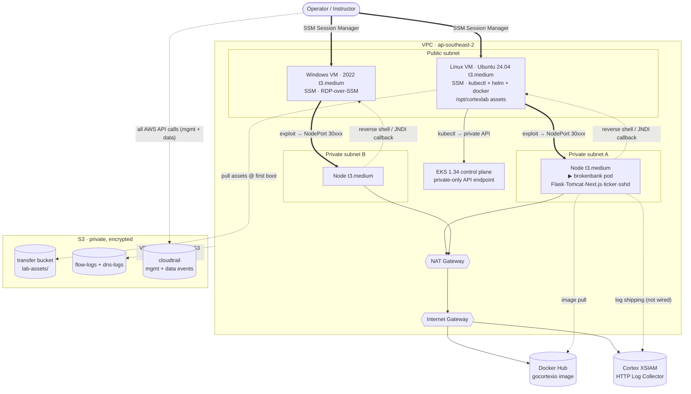

# Architecture

## Overview

A single VPC with one public subnet and two private subnets (one per AZ). The
Linux and Windows VMs run in the public subnet with outbound internet access via
an internet gateway, and are administered through AWS SSM Session Manager (no SSH
keypair, no inbound access). An EKS cluster runs in the private subnets, which
reach the internet through a NAT gateway; its API endpoint is private and
reachable from the VMs.

Resource names (and the `Project` tag) are all derived from `stackPrefix` in
`config/config.yaml`: the deploy scripts pass it to every template as the
`NamePrefix` parameter, and stack names are `<stackPrefix>-<stack>`.

## Architecture at a glance



A plain-text rendering of the same topology lives at
[architecture-diagram.txt](architecture-diagram.txt).

**How to read it:**

- **NodePort exposure** — the app is a NodePort Service, so each port listens on
  *every* node (kube-proxy forwards to the pod, wherever it's scheduled). The
  VMs hit any node's InternalIP on the mapped port:

  | Component | Container port | NodePort |
  |-----------|----------------|----------|
  | Flask     | 8888           | 30888    |
  | Tomcat    | 8080           | 30999    |
  | SpaceATM (Next.js) | 7777  | 30777    |
  | metrics   | 9464           | 30464    |
  | sshd      | 22             | 30022    |
  | ticker    | 6666           | 30666    |

- **Security groups are bidirectional.** VM SGs → cluster SG (all traffic)
  carries both kubectl and exploit traffic; cluster SG → VM SGs (all traffic)
  carries callbacks (reverse shells, Log4Shell JNDI). The VMs otherwise take no
  inbound — they're reached only via SSM.
- **Cluster access** — each VM's instance role is an EKS access entry bound to
  `cluster-admin` (auth mode `API_AND_CONFIG_MAP`), so kubectl works with no
  extra credentials.
- **Egress** — the private subnets reach the internet through a single NAT →
  IGW (image pulls, and XSIAM log shipping once wired); the public-subnet VMs
  egress directly via the IGW.
- **Asset staging** — `deploy-part1.sh` syncs `k8s/`, `config/`, and `scripts/`
  to `transfer/lab-assets/`; the Linux VM pulls them to `/opt/cortexlab/` on
  first boot, so class starts at `deploy-app.sh`.

## Stacks

| Stack   | Template | Purpose | Depends on |
|---------|----------|---------|------------|
| cloudtrail | `templates/security/cloudtrail.yaml` | Multi-region CloudTrail trail logging all management + S3/Lambda data events to its own hardened S3 bucket. | — |
| vpc     | `templates/network/vpc.yaml` | VPC, internet gateway, public subnet, two private subnets, NAT gateway, routing. | — |
| network-logging | `templates/network/logging.yaml` | VPC Flow Logs and Route 53 Resolver DNS query logging, each to its own hardened S3 bucket. | vpc |
| transfer-bucket | `templates/storage/s3.yaml`  | S3 file-transfer relay bucket. | — |
| linux-vm | `templates/compute/linux-vm.yaml` | Linux (Ubuntu 24.04) EC2 instance + SSM instance role with S3 access; first boot installs AWS CLI, Docker, kubectl, Helm. Ubuntu (not AL2023) so cortexcli image scans are supported. | vpc, transfer-bucket |
| win-vm  | `templates/compute/win-vm.yaml` | Windows Server 2022 EC2 instance in the same subnet + SSM instance role with S3 access. | vpc, transfer-bucket |
| eks     | `templates/compute/eks.yaml` | EKS cluster (private-only endpoint) + managed node group in the private subnets; VM security groups and instance roles are granted access. | vpc, linux-vm, win-vm |

## Outbound internet access

The public subnet has `MapPublicIpOnLaunch: true` and a route table sending
`0.0.0.0/0` to the internet gateway. The VMs therefore get a public IP and reach
the internet (and the SSM endpoints) directly.

The two private subnets have no public IPs; their route table sends `0.0.0.0/0`
to a single NAT gateway in the public subnet. This gives the EKS nodes outbound
access to pull images and reach the EKS/ECR/S3/STS endpoints without being
directly reachable from the internet. One NAT gateway (rather than one per AZ)
keeps lab cost down at the expense of AZ-level HA for egress.

## Access model

No keypair. Each instance role grants `AmazonSSMManagedInstanceCore`, so you
connect with:

```bash
aws ssm start-session --target <instance-id>
```

On the Linux VM this opens a shell; on the Windows VM it opens a PowerShell
session. Each VM stack outputs its instance ID and a ready-made connect command.
The security groups have **no inbound rules**; outbound is open.

Both VMs share the public subnet and the S3 transfer bucket. Both VMs default
to `t3.medium`; the Linux VM is sized to run
`cortexcli` container image scans against its local Docker daemon.

### RDP to the Windows VM

SSM Session Manager gives a PowerShell session, but you can also get a full RDP
desktop **without opening any inbound rule** by tunnelling RDP over SSM port
forwarding.

1. **Set a password.** With no keypair there is no auto-generated Administrator
   password to retrieve, so set one from a PowerShell session first:

   ```bash
   aws ssm start-session --target <instance-id>
   ```
   ```powershell
   net user Administrator "<NewPassw0rd!>"
   ```

2. **Open the tunnel** (the `RdpTunnelCommand` stack output):

   ```bash
   aws ssm start-session --target <instance-id> \
     --document-name AWS-StartPortForwardingSession \
     --parameters portNumber=3389,localPortNumber=13389
   ```

3. **Connect an RDP client** to `localhost:13389` and log in as `Administrator`
   with the password from step 1:
   - **Windows:** `mstsc /v:localhost:13389`
   - **macOS:** the *Windows App* (formerly *Microsoft Remote Desktop*, Mac App
     Store) — add a PC pointing at `localhost:13389`.
   - **Linux:** any RDP client, e.g. `xfreerdp /v:localhost:13389 /u:Administrator`.

   On any OS the tunnel command (step 2) is identical; it requires the AWS CLI
   and the **Session Manager plugin** to be installed locally.

Traffic stays inside the SSM channel, so the security group keeps its no-inbound
posture. (The AWS console's Fleet Manager → Remote Desktop offers the same thing
in-browser, also over SSM.)

## File transfer

Since SSM Session Manager has no built-in file copy, the `storage` stack
provisions an S3 bucket as a relay, and the instance role is granted
`ListBucket` / `GetObject` / `PutObject` / `DeleteObject` on it.

```bash
BUCKET=$(aws cloudformation describe-stacks --stack-name sko26-grp0-cortexlab-transfer-bucket \
  --query "Stacks[0].Outputs[?OutputKey=='BucketName'].OutputValue" --output text)

# workstation -> instance
aws s3 cp ./file.tar.gz "s3://$BUCKET/tmp/"
# then inside the SSM session:
aws s3 cp "s3://$BUCKET/tmp/file.tar.gz" .
```

The bucket blocks all public access and must be emptied before the stack can be
deleted. `scripts/delete.sh` does this automatically before deleting the
`storage` stack.

## Logging

The `network-logging` stack sends each log type to its own hardened bucket, so they can
be shared with an upstream analytics system independently:

| Log type | Bucket | Path |
|----------|--------|------|
| VPC Flow Logs | Auto-generated bucket (export `<stackPrefix>-flow-log-bucket-arn`) | `AWSLogs/<account>/vpcflowlogs/...` |
| Resolver DNS query logs | Auto-generated bucket (export `<stackPrefix>-dns-log-bucket-arn`) | `AWSLogs/<account>/vpcdnsquerylogs/...` |

Each bucket blocks all public access, uses SSE-S3, has ACLs disabled
(`BucketOwnerEnforced`), and expires objects after `LogRetentionDays` (default
90). Each policy grants only `delivery.logs.amazonaws.com`, scoped with
`aws:SourceAccount`. No KMS key or IAM delivery role is required for the S3
destination.

`scripts/delete.sh` empties both buckets (like the transfer bucket) before
deleting the stack, since CloudFormation cannot remove a non-empty bucket.

## Account audit logging (CloudTrail)

The `cloudtrail` stack provisions a **multi-region** CloudTrail trail that
delivers to its own hardened bucket:

| What | Value |
|------|-------|
| Trail | `sko26-cortexlab-trail` (multi-region, global service events) |
| Bucket | Auto-generated bucket (export `<stackPrefix>-cloudtrail-bucket-arn`) |
| New-file notifications | SNS topic `<stackPrefix>-cloudtrail-new-file-sns-topic-arn`; notified for every `s3:ObjectCreated:*` event in the trail bucket |
| Path | `AWSLogs/<account>/CloudTrail/<region>/...` |
| Events | **all management events** + **all S3 object and Lambda data events** |
| Integrity | log-file validation enabled (digest files are delivered alongside logs) |

The bucket mirrors the `network-logging` buckets: all public access blocked, SSE-S3,
ACLs disabled (`BucketOwnerEnforced`), objects expire after `LogRetentionDays`
(the stack default is 90; `parameters/cloudtrail.json` overrides it to **15** to
keep lab cost down). The bucket policy grants only `cloudtrail.amazonaws.com`,
scoped by `aws:SourceArn` to this trail. Data-event coverage is expressed with
advanced event selectors (management + one selector per data-event resource
type); add more `resources.type` selectors in the template to widen it.

Data events log object-level activity across **every** bucket in the account —
including the transfer and log buckets — so expect volume. `scripts/delete.sh`
empties the trail bucket before deleting the stack.

> **Shared-account note:** each region allows at most 5 trails. If many groups
> deploy account-wide trails into the *same* account, they will hit that limit;
> in a shared account, only one group should own the `cloudtrail` stack.

## EKS cluster

The `eks` stack runs a managed node group on Amazon Linux 2023 nodes
(`t3.medium` x2 by default) across the two private subnets. The control-plane
version, node instance type, and node group sizing are all parameters
(`parameters/eks.json`).

**Private-only API endpoint.** `EndpointPublicAccess` is `false` and
`EndpointPrivateAccess` is `true`, so the Kubernetes API server is reachable only
from inside the VPC — i.e. from the VMs, not a workstation. Flip
`EndpointPublicAccess` to `true` in the template if you need `kubectl` directly
from your laptop.

**Access from the VMs** is granted two ways, matching "network reachability *and*
kubectl":

- *Network:* the `eks` stack adds ingress rules to the cluster security group
  (attached to both the control-plane ENIs and the nodes) allowing all traffic
  from each VM's security group — covering the API server (443) and pod/service
  traffic. The VM stacks export their security group IDs (`<stackPrefix>-linux-vm-sg-id`,
  `<stackPrefix>-win-vm-sg-id`) for this.
- *Authorization:* each VM's instance role (exported as `<stackPrefix>-linux-vm-role-arn` /
  `<stackPrefix>-win-vm-role-arn`) is mapped as a cluster admin via an EKS **access entry**
  (`AmazonEKSClusterAdminPolicy`). The cluster uses `API_AND_CONFIG_MAP`
  authentication mode, which access entries require.

From a VM (the Linux VM is the natural `kubectl` host), configure `kubectl` with
the `UpdateKubeconfigCommand` stack output:

```bash
aws eks update-kubeconfig --region ap-southeast-2 --name <cluster-name>
kubectl get nodes
```

The node role also includes `AmazonSSMManagedInstanceCore`, so nodes can be
reached through SSM Session Manager like the VMs.

## Target workload: GoCortex Broken Bank

The lab's target application is [GoCortex Broken Bank](https://github.com/gocortexio/gocortexbrokenbank),
an intentionally-vulnerable, Cortex-focused training app. It is **not** a
CloudFormation stack — it is a Kubernetes workload, deployed onto the `eks`
cluster with `kubectl`. The manifest is vendored (and adapted) at
`k8s/gocortexbrokenbank.yaml` so the deployed state is version-controlled like
everything else here.

**One container, six listeners:** Flask/Gunicorn (SAST + GraphQL), Tomcat (Java
RCE endpoints), Next.js SpaceATM (CVE-2025-55182), an OTel Prometheus scrape
endpoint, sshd (leaked key / weak root password), and a WebSocket ticker.

**Exposure — NodePort, not hostPort.** Upstream exposes the app via `hostPort`
with no Service, which would tie access to whichever node the pod lands on. The
vendored manifest instead fronts the Deployment with a **NodePort Service** so
the VMs get a stable target: hit *any* node's private IP on the pinned nodePort,
regardless of where the pod is scheduled. Ports are remapped into the
30000–32767 NodePort range, mirroring the native port in the last three digits:

| Server | Native port | NodePort |
|--------|-------------|----------|
| Flask/Gunicorn (SAST, GraphQL) | 8888 | 30888 |
| Tomcat (Java RCE) | 9999 | 30999 |
| Next.js SpaceATM (CVE-2025-55182) | 7777 | 30777 |
| OTel Prometheus scrape | 9464 | 30464 |
| sshd (leaked key / weak root pw) | 2222 | 30022 |
| Live Transaction Ticker (WS) | 6666 | 30666 |

**Deploy from the Linux VM.** The EKS endpoint is private-only, so `kubectl`
only resolves from inside the VPC. The Linux VM installs `kubectl` (matched to
the cluster's minor version via the `KubectlMinorVersion` parameter) and Helm on
first boot, so it is ready as the kubectl host.

The lab assets are **pre-staged** so class time isn't spent copying files:
`deploy-part1.sh` uploads the `k8s/`, `config/`, and `scripts/` directories to
`s3://<transfer-bucket>/lab-assets/` right after the bucket stack is created
(before the VMs boot), and the Linux VM pulls them to `/opt/cortexlab/` in its
first-boot bootstrap. The repo stays the single source of truth; re-running
`deploy-part1.sh` refreshes the staged copy. In class you just connect over SSM
and run:

```bash
/opt/cortexlab/scripts/deploy-app.sh          # apply, print node IPs + NodePorts
/opt/cortexlab/scripts/deploy-app.sh delete   # remove
```

(The VM role already grants `GetObject`/`ListBucket` on the transfer bucket, and
the bucket name comes from the existing `<stackPrefix>-transfer-bucket-name` export — no new
IAM or exports. The boot-time pull is non-fatal if nothing is staged yet.)

**Running exploits from the VMs.** The `eks` stack already allows *all* traffic
from both VM security groups into the cluster security group, so VM → app
(VM-as-attacker) works with no extra change:

```bash
curl "http://<node-ip>:30888/search?q=' OR '1'='1"          # SQLi (Flask)
curl "http://<node-ip>:30999/exploit-app/execute?cmd=id"    # Java RCE (Tomcat)
```

**Callbacks to the VMs.** Exploits that call *back* to a listener on a VM
(reverse shells, Log4Shell JNDI/DNS callouts) need the VM to accept inbound from
the cluster. The `eks` stack adds `LinuxVmIngressFromCluster` /
`WinVmIngressFromCluster` ingress rules allowing the cluster security group into
each VM security group (pods egress via the node ENI, which is in that SG). This
is the only pod → VM path; the VMs otherwise keep their no-inbound posture.

**Image pull & log egress.** Nodes pull `gocortexio/gocortexbrokenbank:latest`
from Docker Hub and can ship logs to Cortex XSIAM outbound via the NAT gateway.
XSIAM log shipping is left unwired — the `LOG_ENDPOINT_*` / `LOG_AUTH_*` env in
the manifest is commented out with instructions to fill in. (To avoid Docker Hub
rate limits you can optionally mirror the image to ECR.)

**Capacity note.** The container runs a JVM, Node, Gunicorn, and a small local
LLM (the Concierge) together; on the default `t3.medium` nodes it fits but is
tight. Bump `NodeInstanceType` in `parameters/eks.json` if it struggles to
schedule.

## Cross-stack references

`vpc` publishes `<stackPrefix>-vpc-id`, `<stackPrefix>-public-subnet-id`,
`<stackPrefix>-private-subnet-a-id`, and `<stackPrefix>-private-subnet-b-id`.
`network-logging` and the VM stacks import the VPC/public subnet; `eks` imports the private subnets plus the VM security group IDs and instance
role ARNs (exported by the VM stacks). Because of these imports, `eks` must be
deleted before the VM stacks, and those before `vpc`. `scripts/delete.sh` tears
down in reverse deploy order, which satisfies this.

## Deploy order

The deploy is split in two. `scripts/deploy-part1.sh` deploys everything except
EKS, in registry order — `cloudtrail` → `vpc` → `network-logging` → `transfer-bucket` →
`linux-vm` → `win-vm`. `scripts/deploy-part2.sh` then deploys `eks` on its own. The split
exists because `eks` takes ~15 minutes and imports the private subnets (from
`vpc`) and the VM security groups and roles (from the VM stacks), so it must run
last. `scripts/delete.sh` still tears down all stacks in reverse deploy order.

> **Note:** creating the EKS control plane and node group takes ~15 minutes, and
> deleting them a similar amount; `scripts/delete.sh` waits for each stack, so the
> teardown of `eks` will pause there until the node group and control plane are
> gone.
